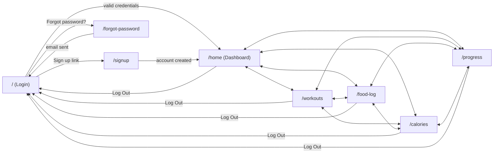
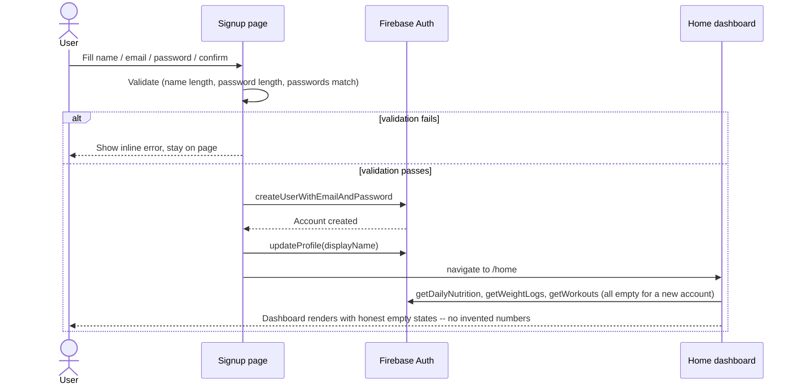
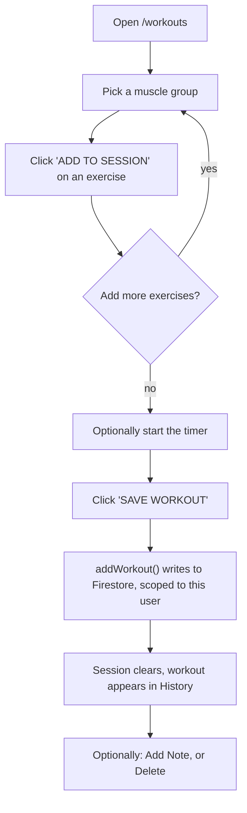
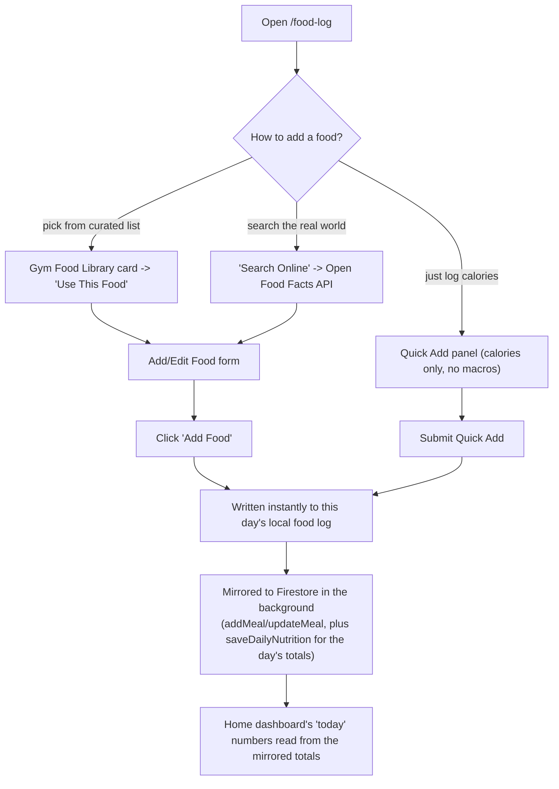
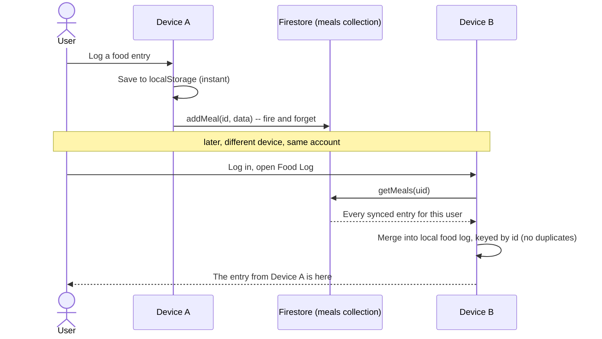
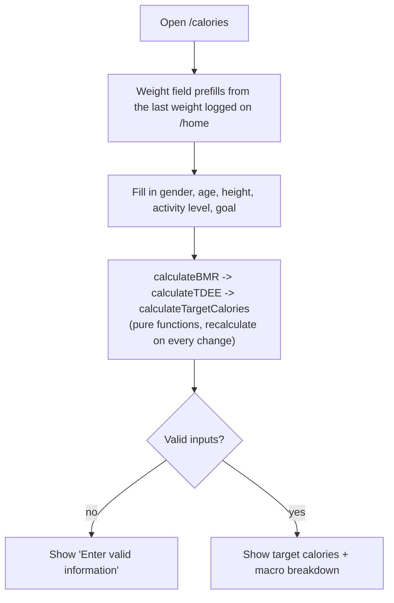
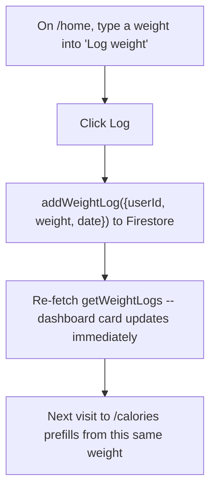
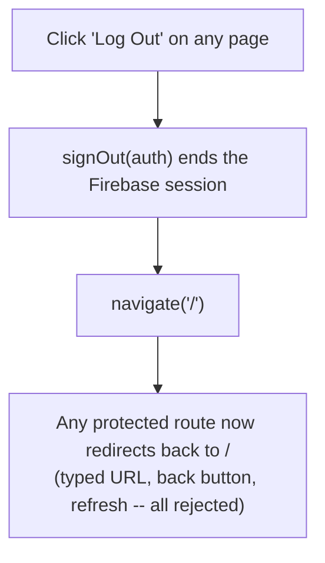

# User Flows

How someone actually moves through the app, end to end. For what each screen does technically, see [`CODEBASE.md`](./CODEBASE.md). For what was tested and the results, see [`TEST_CASES.md`](./TEST_CASES.md).

## App map

Every page below `/home` shares the same sidebar (Dashboard / Workouts / Food Log / Calories / Progress / Log Out) — from anywhere in the app, every other page is one click away.

Every page except Login/Signup/Forgot-Password is behind `ProtectedRoute` — typing any of those URLs directly while logged out redirects straight back to `/`.

## New user: sign up → first look at the dashboard

A brand-new account shows real zeros and empty states everywhere, not placeholder demo data — there's nothing to fake, since nothing's been logged yet.

## Logging a workout

Saved workouts are scoped to the logged-in user (`userId`), so logging in on a different device shows the same history.

## Logging food (three ways, one destination)

The local write is what the user sees instantly — the Firestore mirror happens after, without blocking the UI. If it fails (offline, etc.), the entry still exists locally; only the cross-device sync is what's at risk.

## Food log syncing across devices

This is the piece that was missing for most of development — see `TEST_CASES.md`'s meal-sync section for how it was verified, and `CODEBASE.md` for the id-matching detail that makes edits/deletes work without a round-trip.

## Calculating and tracking calorie targets

`Calories.jsx` only *reads* weight — logging a new weight happens back on the dashboard (see below), which is what this page's prefill reflects.

## Logging body weight from the dashboard

## Signing out

This flow used to skip step B entirely (see `TEST_CASES.md`, Bug #1) — the button navigated back to the login screen without ending the Firebase session underneath, so a protected route was still reachable afterward. Fixed and verified across all five pages.
